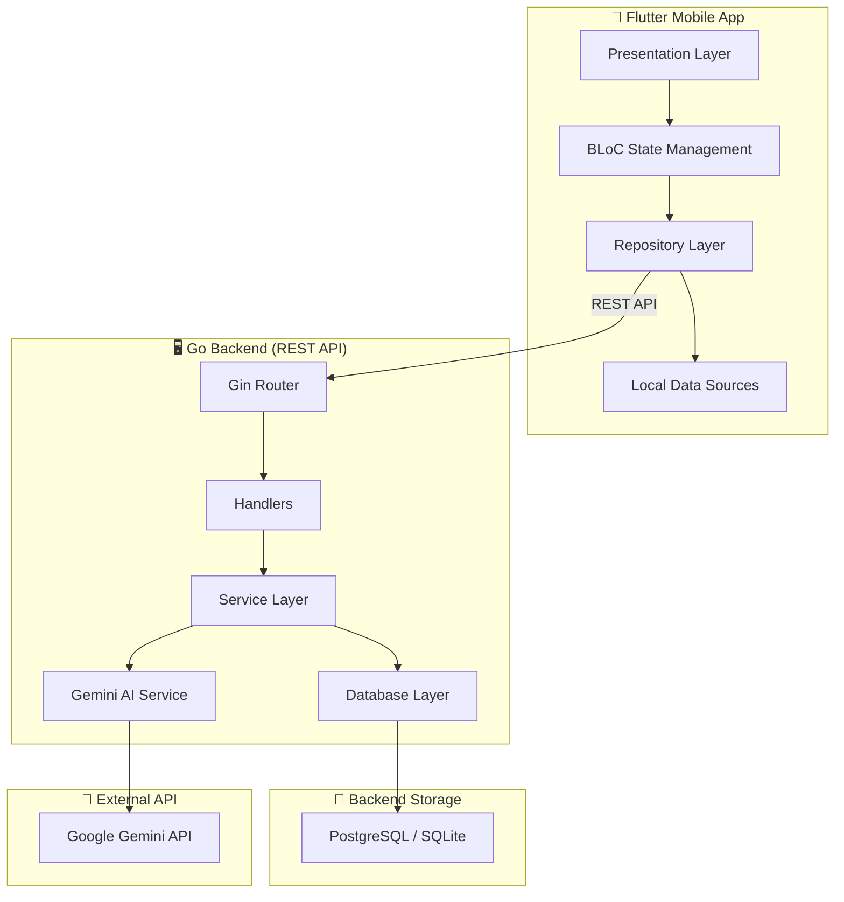
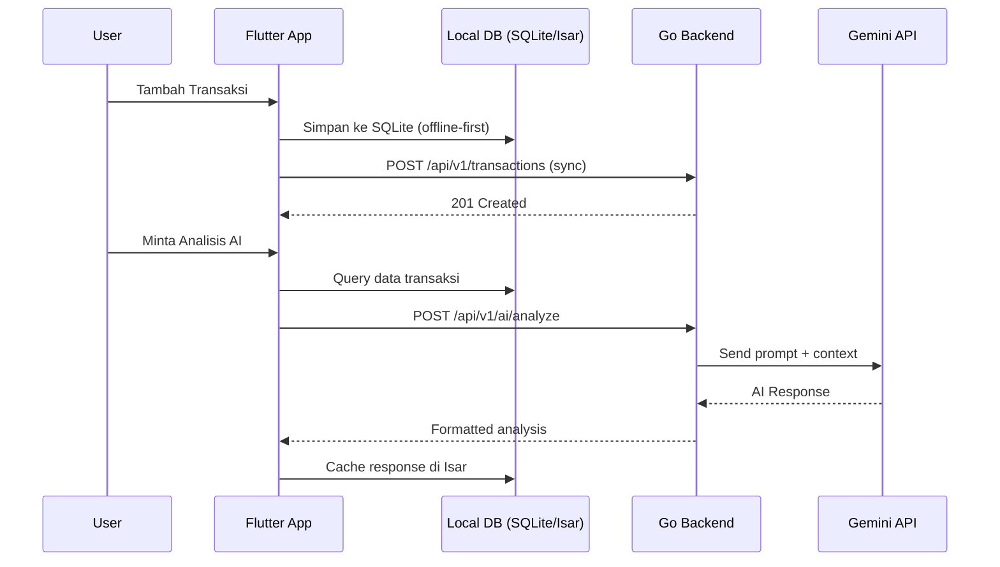
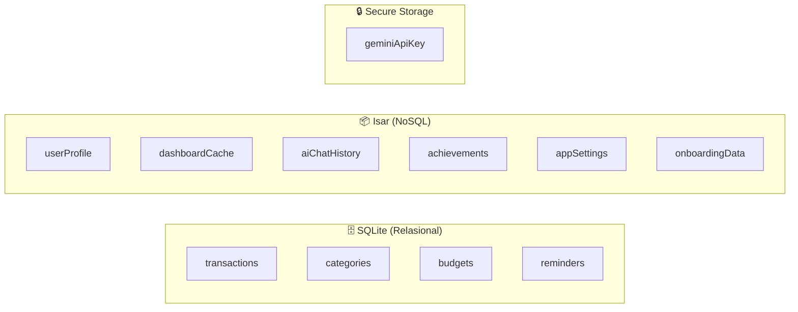
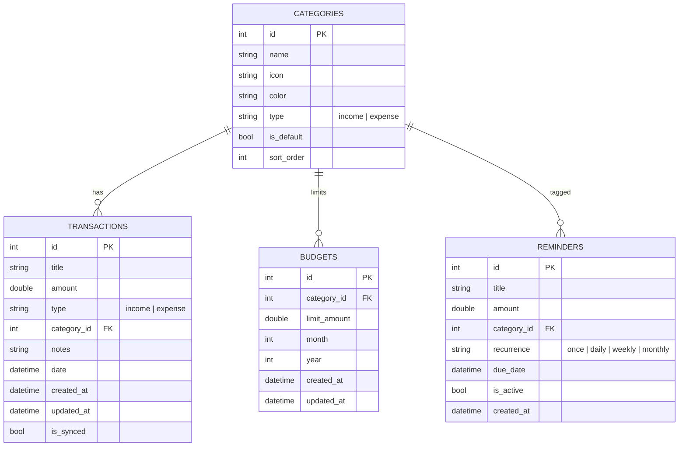
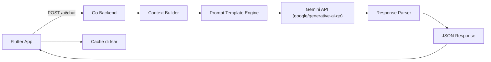

# BudgetKos AI — Implementation Plan (v2)

> [!NOTE]
> **Updated** berdasarkan feedback user. Perubahan utama: arsitektur modular dengan Go backend, dual database (SQLite + Isar), onboarding lebih detail, dan notifikasi harian.

---

## 1. Deskripsi Proyek

**BudgetKos AI** adalah aplikasi mobile Android berbasis Flutter yang dirancang khusus untuk **mahasiswa kos** dalam mengelola keuangan bulanan mereka. Aplikasi ini menggabungkan pencatatan keuangan yang intuitif dengan kecerdasan buatan (Gemini AI) untuk memberikan rekomendasi pengeluaran, pengingat budget, dan analisis pola keuangan yang cerdas.

### Masalah yang Dipecahkan
- Mahasiswa kos sering kesulitan mengatur keuangan bulanan yang terbatas
- Tidak ada pencatatan terstruktur untuk pemasukan dan pengeluaran
- Sulit mengidentifikasi pola pengeluaran boros
- Tidak ada sistem peringatan sebelum budget habis

### Target Pengguna
- Mahasiswa kos berusia 18–25 tahun
- Pengguna dengan budget bulanan terbatas (Rp 1–3 juta/bulan)
- Pengguna Android yang menginginkan solusi keuangan sederhana namun cerdas

### Keputusan Desain (dari Feedback)
| Keputusan | Pilihan |
|-----------|---------|
| API Key Gemini | User input sendiri via Settings |
| Bahasa | Sepenuhnya Bahasa Indonesia |
| Onboarding | Detail (kategori prioritas, target tabungan, manajemen keuangan) |
| Data Backup | Export/Import CSV lokal |
| Notifikasi Harian | Ya — pengingat catat pengeluaran (jam 21:00) |
| Backend | Go (Golang) — modular |
| Database | Dual: SQLite (relasional) + Isar (NoSQL) |

---

## 2. Arsitektur Sistem — Modular

### 2.1 High-Level Architecture



### 2.2 Komunikasi Client-Server



### 2.3 Offline-First Strategy
- **Semua data transaksi** disimpan di SQLite lokal terlebih dahulu
- Sync ke backend saat koneksi tersedia
- **Dashboard cache & AI responses** disimpan di Isar untuk akses cepat
- Conflict resolution: **last-write-wins** dengan timestamp

---

## 3. Tech Stack

### 3.1 Frontend — Flutter

| Komponen | Teknologi | Alasan |
|----------|-----------|--------|
| Framework | **Flutter 3.x** | Cross-platform, performa native, rich UI widgets |
| Bahasa | **Dart 3.x** | Null safety, async/await, strong typing |
| Min SDK | Android API 24 (Android 7.0) | Cakupan 95%+ perangkat Android aktif |
| State Management | **flutter_bloc** | Predictable state, testable, scalable |
| Architecture | **Clean Architecture** | Separation of concerns, maintainability |
| DI | **get_it + injectable** | Service locator pattern, auto-registration |
| Routing | **go_router** | Declarative routing, deep linking support |
| HTTP Client | **dio** | Interceptors, retry logic, error handling |
| Charts | **fl_chart** | Pie, bar, line chart yang customizable |
| Animations | **flutter_animate** | Micro-animations, staggered effects |
| Calendar | **table_calendar** | Calendar view untuk tracking harian |
| Fonts | **Google Fonts** (Poppins, Inter) | Typography modern dan clean |
| Notifications | **flutter_local_notifications** | Pengingat budget, bill reminder |
| Currency Format | **intl** | Format Rupiah (IDR), locale Indonesia |
| PDF Export | **pdf** + **printing** | Export laporan keuangan |

### 3.2 Frontend — Database (Dual Architecture)

| Database | Teknologi | Use Case |
|----------|-----------|----------|
| **SQL (Relational)** | **sqflite** | Transaksi, kategori, budgets, reminders — data yang butuh relational queries, JOIN, aggregasi |
| **NoSQL (Document)** | **isar** | Dashboard cache, user settings, AI chat history, achievement state, onboarding state — data yang butuh fast read, flexible schema |
| **Secure Storage** | **flutter_secure_storage** | Gemini API key, auth tokens |
| **Key-Value** | **shared_preferences** | Theme preference, first launch flag |

#### Pembagian Data antar Database



**Alasan Pembagian:**
- **SQLite** untuk data yang membutuhkan query kompleks (SUM, GROUP BY, JOIN antar tabel) → transaksi keuangan, budget per kategori
- **Isar** untuk data yang membutuhkan fast read, flexible schema, dan tidak butuh relasi kompleks → cache dashboard, settings, chat history

### 3.3 Backend — Go (Golang)

| Komponen | Teknologi | Alasan |
|----------|-----------|--------|
| Bahasa | **Go 1.22+** | Performa tinggi, concurrency, low memory footprint |
| Web Framework | **Gin** | Ringan, cepat, middleware support |
| ORM | **GORM** | Migrasi otomatis, query builder |
| Database | **SQLite** (dev) / **PostgreSQL** (prod-ready) | Relational, ACID compliant |
| AI Client | **google/generative-ai-go** | Official Gemini SDK untuk Go |
| Config | **viper** | Environment variables, config files |
| Logger | **zap** | Structured logging, high performance |
| Validation | **go-playground/validator** | Input validation |
| Migration | **golang-migrate** | Database versioning |
| API Docs | **swaggo/swag** | Auto-generate Swagger/OpenAPI |

---

## 4. Struktur Proyek — Modular

### 4.1 Backend (Go) — Modular Monolith

```
backend/
├── cmd/
│   └── server/
│       └── main.go                    # Entry point
├── internal/
│   ├── config/
│   │   └── config.go                  # App configuration (viper)
│   ├── middleware/
│   │   ├── cors.go                    # CORS middleware
│   │   ├── logger.go                  # Request logging
│   │   └── ratelimit.go              # Rate limiting
│   ├── modules/
│   │   ├── transaction/               # 📝 Module: Transaksi
│   │   │   ├── handler.go            # HTTP handlers
│   │   │   ├── service.go            # Business logic
│   │   │   ├── repository.go         # DB queries
│   │   │   ├── model.go              # Data models
│   │   │   ├── dto.go                # Request/Response DTOs
│   │   │   └── routes.go             # Route registration
│   │   ├── category/                  # 🏷️ Module: Kategori
│   │   │   ├── handler.go
│   │   │   ├── service.go
│   │   │   ├── repository.go
│   │   │   ├── model.go
│   │   │   ├── dto.go
│   │   │   └── routes.go
│   │   ├── budget/                    # 💰 Module: Budget
│   │   │   ├── handler.go
│   │   │   ├── service.go
│   │   │   ├── repository.go
│   │   │   ├── model.go
│   │   │   ├── dto.go
│   │   │   └── routes.go
│   │   ├── reminder/                  # ⏰ Module: Reminder
│   │   │   ├── handler.go
│   │   │   ├── service.go
│   │   │   ├── repository.go
│   │   │   ├── model.go
│   │   │   ├── dto.go
│   │   │   └── routes.go
│   │   ├── ai/                        # 🤖 Module: AI Advisor
│   │   │   ├── handler.go
│   │   │   ├── service.go            # Gemini integration
│   │   │   ├── prompt.go             # Prompt templates
│   │   │   ├── dto.go
│   │   │   └── routes.go
│   │   ├── report/                    # 📊 Module: Laporan
│   │   │   ├── handler.go
│   │   │   ├── service.go
│   │   │   ├── dto.go
│   │   │   └── routes.go
│   │   ├── gamification/              # 🏆 Module: Gamification
│   │   │   ├── handler.go
│   │   │   ├── service.go
│   │   │   ├── repository.go
│   │   │   ├── model.go
│   │   │   └── routes.go
│   │   └── user/                      # 👤 Module: User Profile
│   │       ├── handler.go
│   │       ├── service.go
│   │       ├── repository.go
│   │       ├── model.go
│   │       ├── dto.go
│   │       └── routes.go
│   ├── database/
│   │   ├── database.go               # DB connection & initialization
│   │   └── migrations/               # SQL migration files
│   └── router/
│       └── router.go                  # Route aggregator
├── pkg/
│   ├── response/                      # Standard API response format
│   │   └── response.go
│   ├── validator/                     # Custom validators
│   │   └── validator.go
│   └── utils/                         # Shared utilities
│       ├── currency.go
│       └── time.go
├── go.mod
├── go.sum
├── .env.example
└── Makefile
```

### 4.2 Frontend (Flutter) — Feature-based Modular

```
frontend/
├── lib/
│   ├── app.dart                          # MaterialApp root
│   ├── main.dart                         # Entry point
│   ├── core/
│   │   ├── constants/
│   │   │   ├── api_constants.dart        # Base URL, endpoints
│   │   │   ├── app_constants.dart        # App-wide constants
│   │   │   └── db_constants.dart         # Table names, collection names
│   │   ├── errors/
│   │   │   ├── failures.dart             # Failure classes
│   │   │   └── exceptions.dart           # Exception classes
│   │   ├── network/
│   │   │   ├── api_client.dart           # Dio client setup
│   │   │   ├── api_interceptor.dart      # Auth, logging interceptors
│   │   │   └── network_info.dart         # Connectivity checker
│   │   ├── database/
│   │   │   ├── sqlite_helper.dart        # SQLite initialization & migrations
│   │   │   └── isar_helper.dart          # Isar initialization
│   │   ├── theme/
│   │   │   ├── app_theme.dart            # ThemeData (light & dark)
│   │   │   ├── app_colors.dart           # Color palette
│   │   │   ├── app_typography.dart       # Text styles
│   │   │   └── app_decorations.dart      # Box decorations, gradients
│   │   ├── utils/
│   │   │   ├── currency_formatter.dart   # Rp formatting
│   │   │   ├── date_formatter.dart       # Tanggal Indonesia
│   │   │   ├── greeting_helper.dart      # Selamat pagi/siang/malam
│   │   │   └── validators.dart           # Input validation
│   │   ├── di/
│   │   │   └── injection.dart            # GetIt + Injectable setup
│   │   └── router/
│   │       └── app_router.dart           # GoRouter config
│   │
│   ├── features/
│   │   ├── splash/
│   │   │   └── presentation/
│   │   │       └── pages/
│   │   │           └── splash_page.dart
│   │   │
│   │   ├── onboarding/
│   │   │   ├── presentation/
│   │   │   │   ├── pages/
│   │   │   │   │   └── onboarding_page.dart
│   │   │   │   ├── widgets/
│   │   │   │   │   ├── onboarding_slide.dart
│   │   │   │   │   ├── budget_input_step.dart
│   │   │   │   │   ├── category_priority_step.dart
│   │   │   │   │   └── savings_target_step.dart
│   │   │   │   └── bloc/
│   │   │   │       ├── onboarding_bloc.dart
│   │   │   │       ├── onboarding_event.dart
│   │   │   │       └── onboarding_state.dart
│   │   │   ├── domain/
│   │   │   │   ├── entities/
│   │   │   │   │   └── onboarding_data.dart
│   │   │   │   ├── repositories/
│   │   │   │   │   └── onboarding_repository.dart
│   │   │   │   └── usecases/
│   │   │   │       └── complete_onboarding.dart
│   │   │   └── data/
│   │   │       ├── models/
│   │   │       │   └── onboarding_model.dart
│   │   │       ├── datasources/
│   │   │       │   └── onboarding_local_ds.dart   # Isar
│   │   │       └── repositories/
│   │   │           └── onboarding_repository_impl.dart
│   │   │
│   │   ├── dashboard/
│   │   │   ├── presentation/
│   │   │   │   ├── pages/
│   │   │   │   │   └── dashboard_page.dart
│   │   │   │   ├── widgets/
│   │   │   │   │   ├── balance_card.dart
│   │   │   │   │   ├── quick_stats_row.dart
│   │   │   │   │   ├── budget_progress_bar.dart
│   │   │   │   │   ├── spending_pie_chart.dart
│   │   │   │   │   ├── recent_transactions.dart
│   │   │   │   │   └── ai_insight_card.dart
│   │   │   │   └── bloc/
│   │   │   │       ├── dashboard_bloc.dart
│   │   │   │       ├── dashboard_event.dart
│   │   │   │       └── dashboard_state.dart
│   │   │   ├── domain/
│   │   │   │   ├── entities/
│   │   │   │   │   └── dashboard_summary.dart
│   │   │   │   ├── repositories/
│   │   │   │   │   └── dashboard_repository.dart
│   │   │   │   └── usecases/
│   │   │   │       ├── get_dashboard_summary.dart
│   │   │   │       └── get_ai_insight.dart
│   │   │   └── data/
│   │   │       ├── models/
│   │   │       │   └── dashboard_cache_model.dart  # Isar collection
│   │   │       ├── datasources/
│   │   │       │   ├── dashboard_local_ds.dart     # Isar cache
│   │   │       │   └── dashboard_remote_ds.dart    # API
│   │   │       └── repositories/
│   │   │           └── dashboard_repository_impl.dart
│   │   │
│   │   ├── transactions/
│   │   │   ├── presentation/
│   │   │   │   ├── pages/
│   │   │   │   │   ├── add_transaction_page.dart
│   │   │   │   │   ├── transaction_list_page.dart
│   │   │   │   │   └── transaction_detail_page.dart
│   │   │   │   ├── widgets/
│   │   │   │   │   ├── amount_keypad.dart
│   │   │   │   │   ├── category_grid.dart
│   │   │   │   │   ├── transaction_tile.dart
│   │   │   │   │   └── filter_sheet.dart
│   │   │   │   └── bloc/
│   │   │   │       ├── transaction_bloc.dart
│   │   │   │       ├── transaction_event.dart
│   │   │   │       └── transaction_state.dart
│   │   │   ├── domain/
│   │   │   │   ├── entities/
│   │   │   │   │   └── transaction.dart
│   │   │   │   ├── repositories/
│   │   │   │   │   └── transaction_repository.dart
│   │   │   │   └── usecases/
│   │   │   │       ├── add_transaction.dart
│   │   │   │       ├── get_transactions.dart
│   │   │   │       ├── update_transaction.dart
│   │   │   │       └── delete_transaction.dart
│   │   │   └── data/
│   │   │       ├── models/
│   │   │       │   └── transaction_model.dart
│   │   │       ├── datasources/
│   │   │       │   ├── transaction_local_ds.dart    # SQLite
│   │   │       │   └── transaction_remote_ds.dart   # API
│   │   │       └── repositories/
│   │   │           └── transaction_repository_impl.dart
│   │   │
│   │   ├── budget/
│   │   │   ├── presentation/
│   │   │   │   ├── pages/
│   │   │   │   │   └── budget_planner_page.dart
│   │   │   │   ├── widgets/
│   │   │   │   │   ├── budget_category_card.dart
│   │   │   │   │   └── budget_progress_chart.dart
│   │   │   │   └── bloc/
│   │   │   ├── domain/
│   │   │   └── data/                               # SQLite
│   │   │
│   │   ├── ai_advisor/
│   │   │   ├── presentation/
│   │   │   │   ├── pages/
│   │   │   │   │   └── ai_chat_page.dart
│   │   │   │   ├── widgets/
│   │   │   │   │   ├── chat_bubble.dart
│   │   │   │   │   ├── quick_prompt_chips.dart
│   │   │   │   │   └── typing_indicator.dart
│   │   │   │   └── bloc/
│   │   │   ├── domain/
│   │   │   └── data/                               # Isar (chat history)
│   │   │
│   │   ├── reports/
│   │   │   ├── presentation/
│   │   │   │   ├── pages/
│   │   │   │   │   └── reports_page.dart
│   │   │   │   ├── widgets/
│   │   │   │   │   ├── income_expense_bar_chart.dart
│   │   │   │   │   ├── daily_trend_line_chart.dart
│   │   │   │   │   ├── category_pie_chart.dart
│   │   │   │   │   └── top_spending_list.dart
│   │   │   │   └── bloc/
│   │   │   ├── domain/
│   │   │   └── data/
│   │   │
│   │   ├── categories/
│   │   │   ├── presentation/
│   │   │   ├── domain/
│   │   │   └── data/                               # SQLite
│   │   │
│   │   ├── reminders/
│   │   │   ├── presentation/
│   │   │   │   ├── pages/
│   │   │   │   │   ├── reminder_list_page.dart
│   │   │   │   │   └── add_reminder_page.dart
│   │   │   │   └── bloc/
│   │   │   ├── domain/
│   │   │   └── data/                               # SQLite
│   │   │
│   │   ├── gamification/
│   │   │   ├── presentation/
│   │   │   │   ├── pages/
│   │   │   │   │   └── achievement_page.dart
│   │   │   │   └── widgets/
│   │   │   │       ├── streak_counter.dart
│   │   │   │       └── achievement_badge.dart
│   │   │   ├── domain/
│   │   │   └── data/                               # Isar
│   │   │
│   │   └── settings/
│   │       ├── presentation/
│   │       │   ├── pages/
│   │       │   │   ├── settings_page.dart
│   │       │   │   └── api_key_page.dart
│   │       │   └── bloc/
│   │       ├── domain/
│   │       └── data/                               # Isar (settings)
│   │
│   └── shared/
│       ├── widgets/
│       │   ├── custom_app_bar.dart
│       │   ├── loading_shimmer.dart
│       │   ├── empty_state.dart
│       │   ├── error_widget.dart
│       │   └── glassmorphic_card.dart
│       ├── models/
│       └── extensions/
│           ├── context_extensions.dart
│           ├── datetime_extensions.dart
│           └── number_extensions.dart
│
├── assets/
│   ├── icons/
│   ├── images/
│   └── animations/                    # Lottie files
│
├── pubspec.yaml
└── analysis_options.yaml
```

---

## 5. Backend API Design

### 5.1 Base URL & Versioning
```
Base URL: http://localhost:8080/api/v1
Content-Type: application/json
```

### 5.2 Standard Response Format
```json
{
  "success": true,
  "message": "Berhasil mengambil data",
  "data": { ... },
  "meta": {
    "page": 1,
    "limit": 20,
    "total": 150
  }
}
```

### 5.3 API Endpoints

#### 👤 User Module
| Method | Endpoint | Deskripsi |
|--------|----------|-----------|
| `POST` | `/users` | Buat profil user baru (onboarding) |
| `GET` | `/users/:id` | Ambil profil user |
| `PUT` | `/users/:id` | Update profil user |
| `PUT` | `/users/:id/onboarding` | Simpan data onboarding lengkap |

#### 📝 Transaction Module
| Method | Endpoint | Deskripsi |
|--------|----------|-----------|
| `POST` | `/transactions` | Tambah transaksi baru |
| `GET` | `/transactions` | Daftar transaksi (filter, pagination, search) |
| `GET` | `/transactions/:id` | Detail transaksi |
| `PUT` | `/transactions/:id` | Update transaksi |
| `DELETE` | `/transactions/:id` | Hapus transaksi |
| `GET` | `/transactions/summary` | Ringkasan (total income, expense, balance) |
| `POST` | `/transactions/batch` | Sync batch transaksi dari lokal |

**Query Parameters untuk GET `/transactions`:**
```
?type=expense|income
&category_id=1
&start_date=2026-01-01
&end_date=2026-01-31
&search=makan
&page=1
&limit=20
&sort=date_desc
```

#### 🏷️ Category Module
| Method | Endpoint | Deskripsi |
|--------|----------|-----------|
| `GET` | `/categories` | Daftar semua kategori |
| `POST` | `/categories` | Tambah kategori custom |
| `PUT` | `/categories/:id` | Update kategori |
| `DELETE` | `/categories/:id` | Hapus kategori custom |
| `GET` | `/categories/defaults` | Seed kategori default |

#### 💰 Budget Module
| Method | Endpoint | Deskripsi |
|--------|----------|-----------|
| `POST` | `/budgets` | Set budget bulan ini |
| `GET` | `/budgets` | Ambil budget aktif (bulan & tahun) |
| `PUT` | `/budgets/:id` | Update budget |
| `GET` | `/budgets/progress` | Progress budget vs aktual per kategori |
| `GET` | `/budgets/history` | Histori budget bulan-bulan sebelumnya |

#### ⏰ Reminder Module
| Method | Endpoint | Deskripsi |
|--------|----------|-----------|
| `POST` | `/reminders` | Buat reminder baru |
| `GET` | `/reminders` | Daftar reminder |
| `PUT` | `/reminders/:id` | Update reminder |
| `DELETE` | `/reminders/:id` | Hapus reminder |
| `PUT` | `/reminders/:id/pay` | Tandai sebagai terbayar (auto-create transaksi) |

#### 🤖 AI Module
| Method | Endpoint | Deskripsi |
|--------|----------|-----------|
| `POST` | `/ai/chat` | Chat dengan AI Advisor |
| `POST` | `/ai/analyze-spending` | Analisis pola pengeluaran |
| `POST` | `/ai/budget-recommendation` | Rekomendasi alokasi budget |
| `POST` | `/ai/daily-insight` | Generate insight harian untuk dashboard |
| `GET` | `/ai/chat-history` | Riwayat percakapan |

**Request body untuk `/ai/chat`:**
```json
{
  "message": "Analisis pengeluaran saya bulan ini",
  "api_key": "user-provided-gemini-key",
  "context": {
    "monthly_income": 2000000,
    "total_expense": 1500000,
    "top_categories": [
      {"name": "Makan", "amount": 600000},
      {"name": "Transportasi", "amount": 300000}
    ],
    "budget_remaining": 500000,
    "days_remaining": 12
  }
}
```

#### 📊 Report Module
| Method | Endpoint | Deskripsi |
|--------|----------|-----------|
| `GET` | `/reports/summary` | Ringkasan periode (income, expense, saving) |
| `GET` | `/reports/by-category` | Breakdown per kategori |
| `GET` | `/reports/daily-trend` | Tren harian |
| `GET` | `/reports/monthly-comparison` | Perbandingan antar bulan |
| `GET` | `/reports/export/csv` | Export CSV |

#### 🏆 Gamification Module
| Method | Endpoint | Deskripsi |
|--------|----------|-----------|
| `GET` | `/gamification/achievements` | Daftar semua achievement + status |
| `GET` | `/gamification/streak` | Streak saat ini |
| `POST` | `/gamification/check` | Cek & unlock achievement baru |

---

## 6. Database Design

### 6.1 SQLite Schema (Relational Data)



### 6.2 Isar Collections (NoSQL Data)

```dart
// === User Profile ===
@collection
class UserProfile {
  Id id = Isar.autoIncrement;
  String name = '';
  double monthlyIncome = 0;
  String avatarEmoji = '😊';
  bool onboardingCompleted = false;
  List<String> priorityCategories = [];   // Kategori prioritas dari onboarding
  double savingsTarget = 0;               // Target tabungan bulanan
  DateTime createdAt = DateTime.now();
  DateTime updatedAt = DateTime.now();
}

// === Dashboard Cache ===
@collection
class DashboardCache {
  Id id = Isar.autoIncrement;
  double totalIncome = 0;
  double totalExpense = 0;
  double balance = 0;
  double budgetProgress = 0;              // Persentase 0-100
  String topCategoriesJson = '[]';        // JSON serialized
  String aiInsight = '';                   // Cached daily insight
  DateTime lastUpdated = DateTime.now();
  int month = 0;
  int year = 0;
}

// === AI Chat History ===
@collection
class AiChatMessage {
  Id id = Isar.autoIncrement;
  String role = '';                       // 'user' | 'assistant'
  String message = '';
  DateTime timestamp = DateTime.now();
}

// === Achievement ===
@collection
class Achievement {
  Id id = Isar.autoIncrement;
  String code = '';                       // 'streak_7', 'budget_master', etc.
  String title = '';
  String description = '';
  String icon = '';
  bool isUnlocked = false;
  double progress = 0;                    // 0.0 - 1.0
  DateTime? unlockedAt;
}

// === App Settings ===
@collection
class AppSettings {
  Id id = Isar.autoIncrement;
  String themeMode = 'system';            // 'light' | 'dark' | 'system'
  bool dailyReminderEnabled = true;
  int dailyReminderHour = 21;             // Jam 21:00
  int dailyReminderMinute = 0;
  String currency = 'IDR';
  bool hapticFeedbackEnabled = true;
  int currentStreak = 0;
  DateTime? lastRecordDate;
}

// === Onboarding Data ===
@collection
class OnboardingData {
  Id id = Isar.autoIncrement;
  String userName = '';
  double monthlyBudget = 0;
  double savingsTarget = 0;
  List<String> priorityCategories = [];   // ['Makan', 'Kos', 'Transportasi']
  String financialGoal = '';              // 'hemat' | 'tabungan' | 'investasi'
  DateTime completedAt = DateTime.now();
}
```

### 6.3 Kategori Default (Seeded)

**Pengeluaran:**
| Icon | Nama | Color |
|------|------|-------|
| 🍜 | Makan & Minum | `#EF4444` |
| 🏠 | Kos / Sewa | `#F97316` |
| 🚌 | Transportasi | `#3B82F6` |
| 📚 | Pendidikan & Buku | `#8B5CF6` |
| 📱 | Pulsa & Internet | `#06B6D4` |
| 👕 | Pakaian | `#EC4899` |
| 🎮 | Hiburan | `#F59E0B` |
| 💊 | Kesehatan | `#10B981` |
| 🛒 | Belanja Harian | `#6366F1` |
| 💡 | Listrik & Air | `#14B8A6` |
| 🔧 | Lainnya | `#64748B` |

**Pemasukan:**
| Icon | Nama | Color |
|------|------|-------|
| 💰 | Kiriman Orang Tua | `#10B981` |
| 🎓 | Beasiswa | `#6366F1` |
| 💼 | Kerja Part-time | `#3B82F6` |
| 🎁 | Hadiah / Bonus | `#F59E0B` |
| 📦 | Penjualan Barang | `#8B5CF6` |
| 🔧 | Lainnya | `#64748B` |

---

## 7. Daftar Halaman / Screen

### 7.1 Splash Screen
- Logo animasi BudgetKos AI dengan efek fade-in + scale
- Cek status onboarding → navigasi ke Onboarding atau Dashboard
- Loading indicator subtle

### 7.2 Onboarding Screen (5 step — enhanced)
- **Step 1: Selamat Datang** — Ilustrasi + deskripsi singkat BudgetKos AI
- **Step 2: Profil** — Input nama, pilih avatar emoji
- **Step 3: Budget Bulanan** — Input estimasi pemasukan bulanan + target tabungan (slider)
- **Step 4: Kategori Prioritas** — Pilih 3-5 kategori pengeluaran utama (chip selector) untuk fokus monitoring
- **Step 5: Tujuan Keuangan** — Pilih tujuan: "Hemat pengeluaran", "Nabung rutin", "Kelola budget ketat" (mempengaruhi saran AI)
- Progress indicator dots di atas
- Tombol "Lanjut" dan "Kembali"
- Step terakhir: tombol "Mulai Sekarang" 🚀

### 7.3 Dashboard (Home)
- **Greeting** personalisasi (Selamat pagi/siang/malam, {nama})
- **Balance Card** — Glassmorphic card: saldo saat ini dengan animasi counter
- **Quick Stats Row** — Total Pemasukan ↑, Total Pengeluaran ↓, Sisa Budget
- **Budget Progress Bar** — Visual gradient bar (hijau → kuning → merah)
- **Spending Pie Chart** — Interaktif, tap segment untuk detail kategori
- **Transaksi Terakhir** — 5 transaksi terbaru, tap untuk detail
- **AI Insight Card** — Saran harian dari Gemini (cached di Isar)
- **Streak Badge** — "🔥 7 Hari Berturut-turut!" mini badge
- **Quick Action FAB** — Floating button tambah transaksi

### 7.4 Tambah Transaksi
- Toggle **Pengeluaran / Pemasukan** (tab animasi warna)
- **Amount Keypad** — Numpad besar custom, format Rupiah otomatis
- **Kategori Grid** — Icon grid scrollable, highlight prioritas
- **Judul** — Text field + autocomplete dari histori
- **Tanggal** — Date picker (default hari ini)
- **Catatan** — Optional, collapsible
- **Tombol Simpan** — Animasi success ✓ + confetti

### 7.5 Daftar Transaksi
- **Filter Bar** — Periode, Tipe, Kategori
- **Search** — Cari judul/catatan
- **Grouped List** — Per tanggal, subtotal per hari
- **Swipe Actions** — Kiri: hapus (merah), Kanan: edit (biru)
- **Summary Header** — Total filtered period

### 7.6 Detail Transaksi
- Card detail lengkap (judul, jumlah, kategori, tanggal, catatan)
- Tombol Edit & Hapus
- Navigasi kembali

### 7.7 Budget Planner
- **Set Budget Total** — Input total budget bulan ini
- **Alokasi per Kategori** — Slider/input per kategori
- **Progress Chart** — Horizontal bar tiap kategori (budget vs aktual)
- **Over-budget Alert** — Badge merah + warning
- **AI Suggestion Button** — Rekomendasi alokasi dari Gemini

### 7.8 AI Advisor (Chat)
- **Chat UI** — Bubble messages (user: kanan, AI: kiri)
- **Quick Prompt Chips:**
  - "📊 Analisis pengeluaran bulan ini"
  - "💰 Berapa yang bisa saya tabung?"
  - "💡 Tips hemat untuk anak kos"
  - "📈 Prediksi pengeluaran minggu depan"
  - "🎯 Evaluasi target tabungan saya"
- **Typing Indicator** — Animasi dots saat menunggu response
- **Chat History** — Scroll ke percakapan sebelumnya (Isar)

### 7.9 Laporan Keuangan (Reports)
- **Periode Selector** — Minggu ini / Bulan ini / 3 Bulan / Custom
- **Summary Cards** — Pemasukan, Pengeluaran, Tabungan
- **Bar Chart** — Income vs Expense per minggu/bulan
- **Line Chart** — Tren pengeluaran harian
- **Pie Chart** — Distribusi per kategori
- **Top 5 Spending** — Kategori tertinggi
- **Export CSV Button** — Download CSV

### 7.10 Pengingat / Reminders
- **Daftar Reminder** — Sortir by due date
- **Status Badge** — Upcoming (kuning), Overdue (merah), Paid (hijau)
- **Tambah Reminder** — Judul, jumlah, frekuensi, due date
- **Mark as Paid** → Auto-create transaksi pengeluaran
- **Notifikasi Push** — Pada tanggal jatuh tempo

### 7.11 Kategori Management
- **Daftar** — Default + custom, drag to reorder
- **Tambah Custom** — Nama, icon picker, color picker, tipe
- **Edit / Hapus** — Kategori default tidak bisa dihapus

### 7.12 Gamification / Achievement
- **Streak Counter** — Hari berturut-turut catat transaksi (🔥 animasi)
- **Achievement Grid:**
  - 🔥 "Konsisten 7 Hari"
  - 💪 "Budget Master" — Tidak melebihi budget 1 bulan
  - 📊 "Data Driven" — 100 transaksi tercatat
  - 🎯 "Hemat Hero" — Pengeluaran < 80% budget
  - 🏆 "Tabungan Champion" — Nabung 3 bulan berturut-turut
  - 📝 "Pencatat Handal" — 30 hari streak
- **Progress Bar** — Progress ke achievement berikutnya
- **Unlock Animation** — Celebratory animation + haptic

### 7.13 Settings
- **Profil** — Edit nama, avatar emoji
- **Budget Default** — Ubah budget bulanan default
- **Target Tabungan** — Edit target tabungan
- **Tema** — Light / Dark / Sistem
- **Notifikasi Harian** — Toggle ON/OFF + **Time Picker** untuk atur jam pengingat (default 21:00)
- **Notifikasi Budget** — Toggle ON/OFF pengingat saat mendekati/melebihi limit
- **Gemini API Key** — Input API key (masked, stored in secure storage)
- **Server URL** — Konfigurasi URL backend
- **Data** — Export CSV, Import CSV, Reset semua data (konfirmasi ganda)
- **Tentang** — Versi, lisensi

### 7.14 Bottom Navigation
4 tab + FAB tengah:
1. 🏠 **Beranda** (Dashboard)
2. 📊 **Laporan** (Reports)
3. ➕ **FAB** (Tambah Transaksi) — Floating di tengah
4. 🤖 **AI Advisor** (Chat)
5. ⚙️ **Pengaturan** (Settings)

---

## 8. Integrasi Gemini AI — Detail

### Prompt Engineering

```
System Prompt:
"Kamu adalah BudgetKos AI, asisten keuangan pribadi untuk mahasiswa kos di Indonesia.
Kamu membantu mengelola keuangan bulanan dengan budget terbatas (Rp 1-3 juta/bulan).
Berikan saran yang praktis, spesifik, dan menggunakan bahasa Indonesia yang ramah dan santai.
Gunakan data keuangan pengguna untuk memberikan insight yang personal.
Format jawaban dengan poin-poin singkat dan emoji yang relevan.
Jangan pernah menjawab pertanyaan di luar konteks keuangan pribadi."
```

### Use Cases

| Use Case | Trigger | Data yang Dikirim | Output |
|----------|---------|-------------------|--------|
| Analisis Pengeluaran | User klik "Analisis" | Transaksi 1 bulan (aggregated) | Pola spending, perbandingan kategori |
| Rekomendasi Budget | User buka Budget Planner | Income + histori 3 bulan | Alokasi optimal per kategori |
| Deteksi Anomali | Auto setelah input transaksi besar | Transaksi baru vs rata-rata | Alert jika anomali |
| Daily Insight | Auto refresh dashboard | Summary bulan ini | 1 kalimat insight/tips |
| Chat Bebas | User ketik di AI Chat | Pesan + context keuangan | Jawaban relevan |

### Pipeline



### Error Handling & Security
- API key dikirim per-request dari client (tidak disimpan di backend)
- Retry 3x dengan exponential backoff
- Rate limiting: max 20 request/menit per user
- Fallback message jika API gagal
- Data yang dikirim ke Gemini: hanya data agregat, bukan raw transaksi

---

## 9. Notifikasi Harian

### Implementasi
- **Package:** `flutter_local_notifications`
- **Default waktu:** 21:00 — **dapat diubah oleh pengguna** melalui **Time Picker** di halaman Settings
- **Konfigurasi di Settings:**
  - Toggle ON/OFF pengingat harian
  - **Time Picker** untuk memilih jam & menit pengingat (format 24 jam)
  - Disimpan di Isar `AppSettings.dailyReminderHour` & `AppSettings.dailyReminderMinute`
  - Saat user mengubah waktu → cancel notifikasi lama, schedule ulang dengan waktu baru
- **Pesan dinamis:**
  - Jika belum catat hari ini → "📝 Sudah catat pengeluaran hari ini? Yuk catat biar keuanganmu terpantau!"
  - Jika sudah catat hari ini → "🎉 Mantap! Kamu sudah catat hari ini. Pertahankan streakmu!"
- **Streak integration:** Jika user catat setiap hari → increment streak

---

## 10. UI/UX Design System

### Color Palette

| Token | Light Mode | Dark Mode | Penggunaan |
|-------|-----------|-----------|------------|
| Primary | `#0D9488` (Teal 600) | `#2DD4BF` (Teal 400) | Tombol utama, aksen |
| Secondary | `#6366F1` (Indigo 500) | `#818CF8` (Indigo 400) | AI features, secondary |
| Background | `#F8FAFC` (Slate 50) | `#0F172A` (Slate 900) | Background utama |
| Surface | `#FFFFFF` | `#1E293B` (Slate 800) | Cards, sheets |
| Income | `#10B981` (Emerald 500) | `#34D399` (Emerald 400) | Pemasukan |
| Expense | `#EF4444` (Red 500) | `#F87171` (Red 400) | Pengeluaran |
| Warning | `#F59E0B` (Amber 500) | `#FBBF24` (Amber 400) | Budget warning |

### Typography
- **Heading:** Poppins (Bold/SemiBold)
- **Body:** Inter (Regular/Medium)
- **Numbers:** Poppins (Bold) — angka keuangan

### Design Principles
1. **Glassmorphism** — Translucent cards + blur pada dashboard
2. **Micro-animations** — Smooth transitions, bounce FAB, slide-in list
3. **8px Grid** — Consistent spacing
4. **Rounded Corners** — 12-16px radius
5. **Subtle Shadows** — Depth hierarchy
6. **Haptic Feedback** — Vibration pada aksi penting

---

## 11. Verification Plan

### Automated Tests
```bash
# Backend tests
cd backend && go test ./...

# Frontend unit tests
cd frontend && flutter test

# Frontend widget tests
cd frontend && flutter test --tags=widget
```

### Manual Verification
1. **Backend:** Jalankan `go run cmd/server/main.go`, test via Postman/curl
2. **Frontend:** `flutter run` pada emulator Android API 34
3. **Functional:** CRUD transaksi, set budget, chat AI, export CSV
4. **UI/UX:** Light/Dark theme, animasi 60fps, responsive
5. **Performance:**
   - App launch < 2 detik
   - DB query < 100ms
   - APK size < 30MB

---

## 12. Timeline Development

### Fase 1 — Foundation
- Setup Flutter project & Go project
- Folder structure kedua sisi
- SQLite + Isar setup di Flutter
- GORM + migrations di Go
- Theme system (Light/Dark)
- Bottom navigation & routing
- API client (Dio) + standard response

### Fase 2 — Core Features
- Kategori CRUD (backend + frontend)
- Transaksi CRUD (backend + frontend + SQLite)
- Dashboard screen + chart + Isar cache
- Budget planner & progress monitoring

### Fase 3 — AI & Advanced
- Gemini integration di Go backend
- AI Advisor chat screen
- AI insight card di dashboard
- Bill reminders + notifikasi lokal
- Notifikasi harian (jam 21:00)

### Fase 4 — Gamification & Polish
- Achievement system (Isar)
- Streak counter
- Onboarding flow (5 step)
- Reports + CSV export
- Settings lengkap (API key, server URL)

### Fase 5 — Optimization & Testing
- Animations & micro-interactions
- Performance optimization
- Error handling & edge cases
- Final testing & bug fixes
