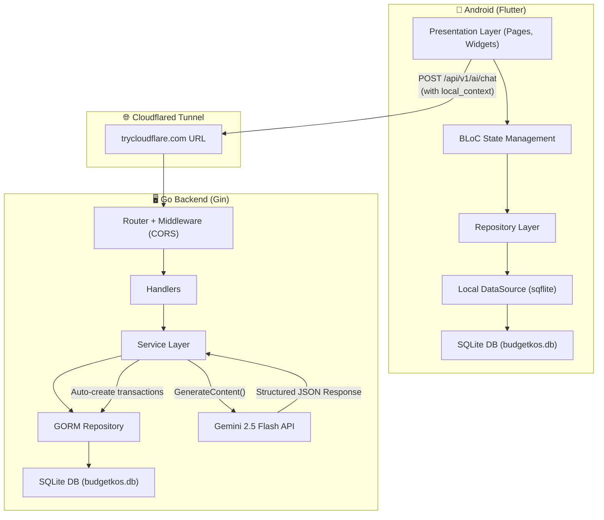
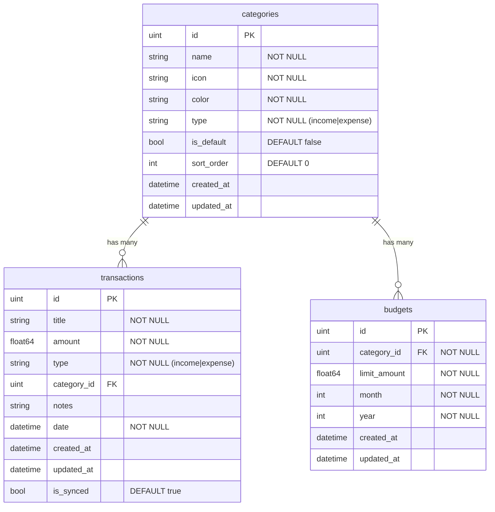
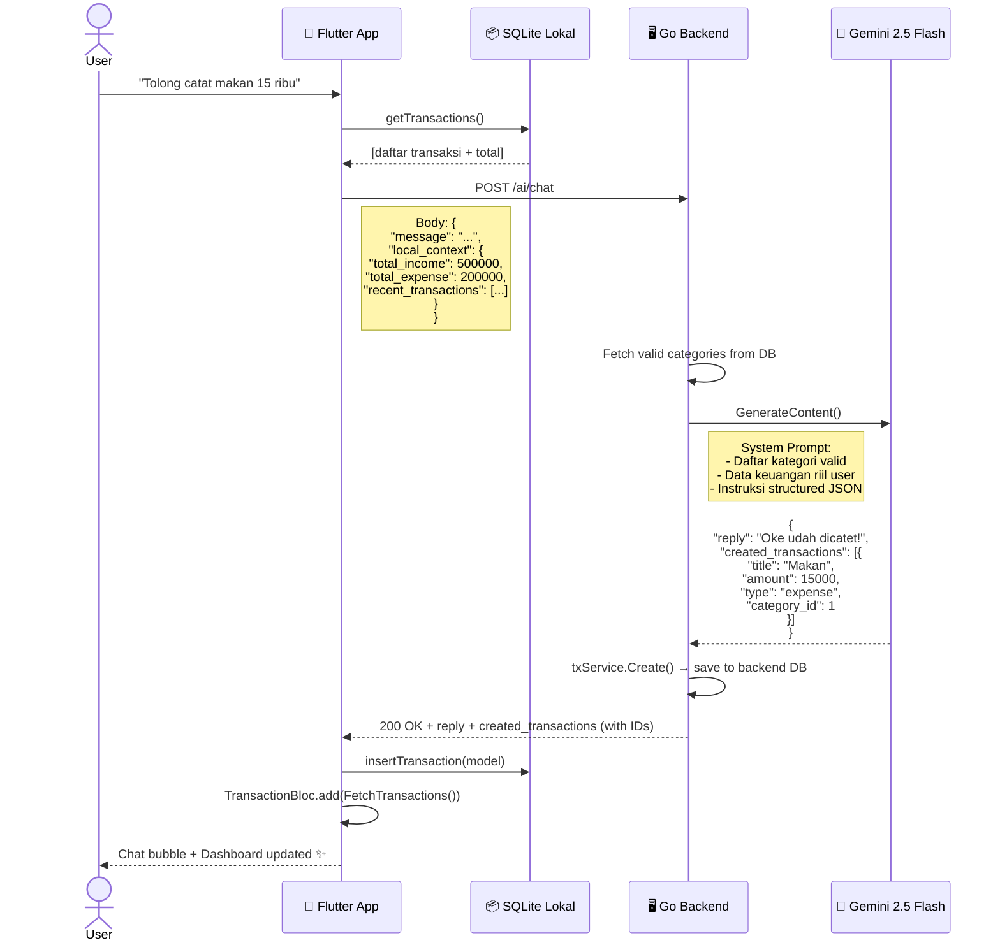
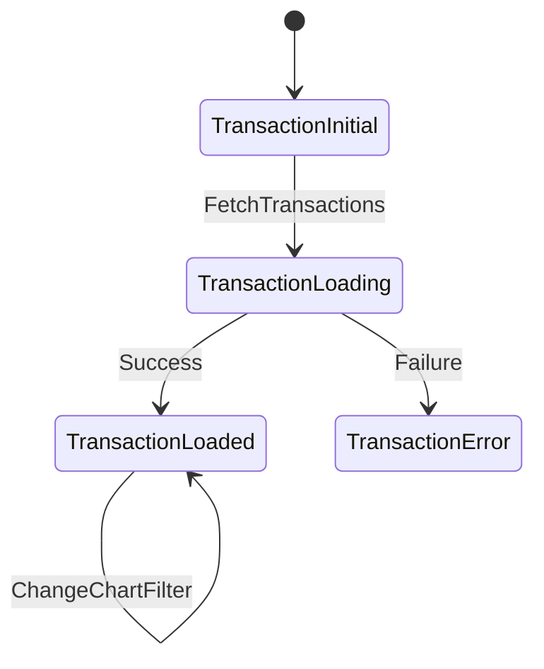
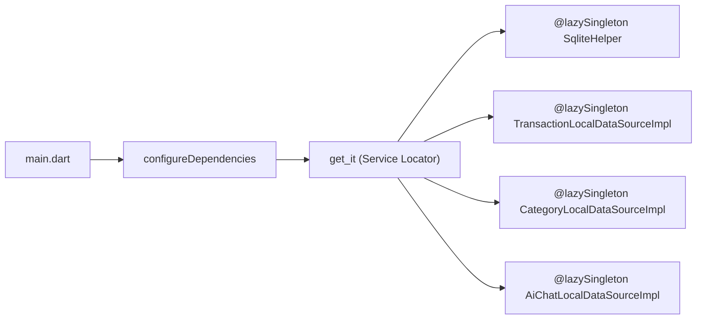

# BudgetKos AI — Dokumentasi Arsitektur & Implementasi

> Dokumen ini merupakan **sumber kebenaran tunggal** (*single source of truth*) yang menggambarkan seluruh arsitektur, struktur kode, alur data, dan keputusan desain dari aplikasi **BudgetKos AI** sebagaimana kondisi *source code* saat ini (Juni 2026).

---

## 1. Ringkasan Proyek

| Aspek | Detail |
|---|---|
| **Nama** | BudgetKos AI |
| **Deskripsi** | Aplikasi pencatatan keuangan pribadi untuk mahasiswa / anak kos, dilengkapi AI Consultant (Bud-AI) yang mampu menganalisis data keuangan dan **mencatatkan transaksi secara otomatis** melalui *chat*. |
| **Target Pengguna** | Mahasiswa, anak kos, pekerja muda di Indonesia |
| **Platform** | Android (APK) |
| **Bahasa UI** | Bahasa Indonesia (bahasa gaul anak muda) |
| **Repository** | `github.com/rafrusth/budgetKos_KB` |

---

## 2. Tech Stack

### 2.1 Frontend — Flutter

| Komponen | Teknologi | Versi |
|---|---|---|
| Framework | Flutter / Dart | SDK ≥ 3.12.1 |
| State Management | `flutter_bloc` | 8.1.6 |
| Routing | `go_router` | 14.6.2 |
| DI | `get_it` + `injectable` | 7.6.4 / 2.4.0 |
| Database Lokal | `sqflite` | 2.4.3 |
| HTTP Client | `dio` | 5.8.0 |
| Charts | `fl_chart` | 0.70.2 |
| Markdown Render | `flutter_markdown` | 0.7.7+1 |
| Koneksi Check | `connectivity_plus` | 7.1.1 |
| Secure Storage | `flutter_secure_storage` | 9.2.2 |
| PDF Export | `pdf` + `printing` | 3.11.1 / 5.13.1 |
| Toast | `toastification` | 3.2.0 |
| Calendar | `table_calendar` | 3.1.2 |
| Fonts | `google_fonts` | 6.2.1 |
| Animations | `flutter_animate` | 4.5.2 |
| Notifications | `flutter_local_notifications` | 18.0.1 |

### 2.2 Backend — Go (Golang)

| Komponen | Teknologi | Versi |
|---|---|---|
| HTTP Framework | Gin Gonic | 1.12.0 |
| ORM | GORM | 1.31.1 |
| Database | SQLite (via `gorm.io/driver/sqlite`) | 1.6.0 |
| Config | Viper (`.env`) | 1.21.0 |
| CORS | `gin-contrib/cors` | 1.7.7 |
| AI | Google Generative AI SDK (`genai`) | latest |
| Go Version | 1.26.4 | — |

### 2.3 Infrastruktur & Deployment

| Komponen | Teknologi |
|---|---|
| Tunneling (Dev) | Cloudflared (`trycloudflare.com`) |
| Container | Dockerfile (multi-stage: `golang:1.22-alpine` → `alpine:latest`) |
| Exposed Port | 8081 (local) |

---

## 3. Arsitektur Sistem — High Level



### Poin Penting Arsitektur

1. **Offline-First**: Seluruh data transaksi, kategori, dan riwayat chat disimpan di **SQLite lokal HP** (`sqflite`). Aplikasi berfungsi penuh tanpa internet kecuali fitur AI Chat.
2. **Context Injection**: Saat user mengirim pesan ke AI, Flutter mengumpulkan **seluruh data transaksi lokal** (total income, total expense, 50 transaksi terakhir) dan mengirimnya sebagai `local_context` dalam body request HTTP. Backend **tidak** membaca database backend-nya sendiri untuk konteks user.
3. **AI Automation**: Gemini merespons dalam format **Structured JSON** (`application/json`). Jika ada transaksi yang perlu dibuat, backend langsung meng-*execute* `txService.Create()` dan mengembalikan record lengkap ke Flutter, yang kemudian juga menyimpannya ke SQLite lokal.

---

## 4. Struktur Direktori

### 4.1 Backend (`backend/`)

```
backend/
├── .env                          # Konfigurasi (PORT, DB_FILE, GEMINI_API_KEY)
├── Dockerfile                    # Multi-stage build
├── cmd/
│   └── server/
│       └── main.go               # Entry point
├── internal/
│   ├── config/
│   │   └── config.go             # Viper config loader
│   ├── database/
│   │   └── database.go           # GORM connection + AutoMigrate
│   ├── middleware/
│   │   └── cors.go               # CORS middleware
│   ├── router/
│   │   └── router.go             # Route registration
│   └── modules/
│       ├── ai/
│       │   ├── handler.go        # ChatRequest + LocalContext struct
│       │   ├── service.go        # Gemini integration + automation
│       │   └── routes.go         # POST /ai/chat
│       ├── category/
│       │   ├── model.go          # Category GORM model
│       │   ├── repository.go     # CRUD repository
│       │   ├── service.go        # Business logic
│       │   ├── handler.go        # HTTP handlers
│       │   └── routes.go         # CRUD routes
│       ├── transaction/
│       │   ├── model.go          # Transaction GORM model
│       │   ├── repository.go     # CRUD repository
│       │   ├── service.go        # Business logic
│       │   ├── handler.go        # HTTP handlers
│       │   └── routes.go         # CRUD routes
│       ├── budget/
│       │   ├── model.go          # Budget GORM model
│       │   ├── repository.go     # CRUD repository
│       │   ├── service.go        # Business logic
│       │   ├── handler.go        # HTTP handlers
│       │   └── routes.go         # CRUD routes
│       ├── gamification/         # (Empty — belum diimplementasi)
│       ├── reminder/             # (Empty — belum diimplementasi)
│       ├── report/               # (Empty — belum diimplementasi)
│       └── user/                 # (Empty — belum diimplementasi)
└── pkg/
    └── response/
        └── response.go           # Standardized JSON response helper
```

### 4.2 Frontend (`frontend/lib/`)

```
frontend/lib/
├── main.dart                     # Entry point + DI init
├── app.dart                      # BudgetKosApp widget (MultiBlocProvider, Router, Theme)
├── core/
│   ├── constants/                # App-wide constants
│   ├── database/
│   │   └── sqlite_helper.dart    # SQLite schema + seed data (6 default categories)
│   ├── di/
│   │   ├── injection.dart        # get_it + injectable setup
│   │   └── injection.config.dart # Auto-generated DI config
│   ├── errors/                   # Error handling
│   ├── network/
│   │   └── api_client.dart       # Dio singleton (Cloudflared tunnel URL)
│   ├── presentation/
│   │   └── pages/
│   │       └── main_scaffold.dart  # Glass bottom nav bar + animated tabs
│   ├── router/
│   │   └── app_router.dart       # GoRouter + AnimatedBranchContainer
│   ├── theme/
│   │   └── app_theme.dart        # Light & Dark theme
│   ├── utils/
│   │   └── toast_helper.dart     # Toast notifications
│   └── widgets/
│       ├── network_aware_widget.dart   # Offline indicator
│       └── pin_protection_widget.dart  # PIN lock screen
├── features/
│   ├── ai/
│   │   ├── data/
│   │   │   └── datasources/
│   │   │       └── ai_chat_local_ds.dart   # Chat history SQLite CRUD
│   │   └── presentation/
│   │       └── pages/
│   │           └── ai_chat_page.dart       # AI chat UI + automation handler
│   ├── categories/
│   │   ├── data/
│   │   │   ├── datasources/
│   │   │   │   └── category_local_ds.dart  # Category SQLite CRUD
│   │   │   └── repositories/
│   │   │       └── category_repository_impl.dart
│   │   ├── domain/
│   │   │   └── repositories/
│   │   │       └── category_repository.dart
│   │   └── presentation/
│   │       ├── bloc/
│   │       │   ├── category_bloc.dart
│   │       │   ├── category_event.dart
│   │       │   └── category_state.dart
│   │       └── pages/
│   │           ├── categories_page.dart
│   │           └── category_form_page.dart
│   ├── dashboard/
│   │   └── presentation/
│   │       └── pages/
│   │           └── dashboard_page.dart     # Home screen (saldo, chart, recent tx)
│   ├── onboarding/                         # First-run onboarding flow
│   ├── profile/
│   │   └── presentation/
│   │       └── pages/
│   │           └── profile_page.dart       # User settings
│   ├── reports/
│   │   └── presentation/
│   │       └── pages/
│   │           └── reports_page.dart       # Financial reports & PDF export
│   ├── splash/                             # Splash screen
│   ├── transaction/
│   │   ├── data/
│   │   │   └── models/
│   │   │       ├── transaction_model.dart  # Model with fromJson/toJson
│   │   │       └── category_model.dart     # Category model (feature-local)
│   │   ├── domain/
│   │   │   └── repositories/
│   │   │       └── transaction_repository.dart  # SQLite-based repository
│   │   └── presentation/
│   │       ├── bloc/
│   │       │   ├── transaction_bloc.dart    # Core BLoC (CRUD + chart data)
│   │       │   ├── transaction_event.dart   # Events (Fetch, Add, Update, Delete, ChartFilter)
│   │       │   └── transaction_state.dart   # States (Initial, Loading, Loaded, Error)
│   │       └── widgets/
│   │           └── transaction_bottom_sheet.dart  # FAB bottom sheet for adding tx
│   └── transactions/
│       ├── data/
│       │   └── datasources/
│       │       └── transaction_local_ds.dart     # Injectable SQLite datasource
│       └── presentation/
│           └── pages/
│               ├── transactions_page.dart        # Full transaction list
│               └── add_transaction_page.dart      # Add transaction form
└── shared/
    ├── extensions/                # Dart extensions
    ├── models/
    │   ├── category_model.dart   # Shared category model (fromMap/toMap)
    │   └── transaction_model.dart # Shared transaction model (fromMap/toMap)
    └── widgets/                  # Reusable UI components
```

---

## 5. Database Schema

### 5.1 Backend SQLite (GORM AutoMigrate)



### 5.2 Frontend SQLite (sqflite Manual Schema)

| Tabel | Kolom | Catatan |
|---|---|---|
| `transactions` | id, title, amount, type, category_id, notes, date, created_at, updated_at, is_synced | Skema identik dengan backend |
| `categories` | id, name, icon, color, type, is_default, sort_order | 6 kategori default di-*seed* saat `onCreate` |
| `ai_chats` | id, prompt, response, timestamp | Riwayat percakapan AI lokal |

**Default Categories (Seed Data):**

| ID | Nama | Tipe | Ikon | Warna |
|---|---|---|---|---|
| 1 | Makanan | expense | restaurant | #FF9800 |
| 2 | Transportasi | expense | directions_car | #2196F3 |
| 3 | Tagihan | expense | receipt | #F44336 |
| 4 | Belanja | expense | shopping_cart | #9C27B0 |
| 5 | Gaji | income | account_balance_wallet | #4CAF50 |
| 6 | Bonus | income | card_giftcard | #00BCD4 |

---

## 6. API Endpoints

Semua endpoint di-prefix dengan `/api/v1`.

### 6.1 Category

| Method | Path | Handler | Deskripsi |
|---|---|---|---|
| GET | `/categories` | `category.GetAll` | Ambil semua kategori |
| POST | `/categories` | `category.Create` | Buat kategori baru |
| PUT | `/categories/:id` | `category.Update` | Update kategori |
| DELETE | `/categories/:id` | `category.Delete` | Hapus kategori |

### 6.2 Transaction

| Method | Path | Handler | Deskripsi |
|---|---|---|---|
| GET | `/transactions` | `transaction.GetAll` | Ambil semua transaksi |
| POST | `/transactions` | `transaction.Create` | Buat transaksi baru |
| PUT | `/transactions/:id` | `transaction.Update` | Update transaksi |
| DELETE | `/transactions/:id` | `transaction.Delete` | Hapus transaksi |

### 6.3 Budget

| Method | Path | Handler | Deskripsi |
|---|---|---|---|
| GET | `/budgets` | `budget.GetAll` | Ambil semua budget |
| POST | `/budgets` | `budget.Create` | Buat budget baru |
| PUT | `/budgets/:id` | `budget.Update` | Update budget |
| DELETE | `/budgets/:id` | `budget.Delete` | Hapus budget |

### 6.4 AI Chat

| Method | Path | Handler | Deskripsi |
|---|---|---|---|
| POST | `/ai/chat` | `ai.Chat` | Kirim pesan + local_context, terima reply + created_transactions |

### 6.5 Utility

| Method | Path | Deskripsi |
|---|---|---|
| GET | `/ping` | Health check → `{"message": "pong"}` |

---

## 7. Alur AI Automation (Bud-AI)

Ini adalah fitur inti yang membedakan BudgetKos AI dari aplikasi keuangan biasa.



### 7.1 Detail Implementasi AI

**Backend** (`ai/service.go`):
- Model: `gemini-2.5-flash`
- `ResponseMIMEType`: `application/json` (memaksa output JSON)
- **System Prompt** berisi:
  1. Persona konsultan keuangan anak kos (bahasa gaul)
  2. Instruksi otomasi: jika diminta mencatat, masukkan ke `created_transactions[]`
  3. Daftar kategori valid dari database (ID + Name + Type)
  4. Data keuangan riil dari `local_context` HP user
- **Parsing**: Response JSON di-*unmarshal* ke `GeminiResponse` struct
- **Execution**: Setiap item di `created_transactions` langsung di-*create* via `txService.Create()`

**Frontend** (`ai_chat_page.dart`):
- Mengumpulkan 50 transaksi terakhir + total income/expense dari SQLite lokal
- Mengirim sebagai `local_context` dalam POST body
- Jika response mengandung `created_transactions`, masing-masing disimpan ke SQLite lokal via `TransactionLocalDataSource.insertTransaction()`
- Memicu `TransactionBloc.add(FetchTransactions())` agar Dashboard auto-refresh

---

## 8. Navigasi & UI

### 8.1 Bottom Navigation (Glass Morphism)

```
┌──────────────────────────────────────┐
│  🏠 Beranda  📊 Laporan  ➕  ✨ Chat AI  👤 Profil  │
└──────────────────────────────────────┘
```

- Implementasi: `MainScaffold` dengan `StatefulShellRoute` dari `go_router`
- Transisi: `AnimatedBranchContainer` — slide horizontal antar halaman (bukan fade)
- FAB di tengah: Membuka `TransactionBottomSheet` untuk input transaksi cepat
- Desain: Glassmorphism (`BackdropFilter` + `ClipRRect`)

### 8.2 Halaman Utama

| Route | Halaman | Deskripsi |
|---|---|---|
| `/` | `DashboardPage` | Saldo, chart (fl_chart), transaksi terbaru |
| `/reports` | `ReportsPage` | Laporan keuangan, PDF export |
| `/ai` | `AIChatPage` | Chat AI (Bud-AI) dengan otomasi |
| `/profile` | `ProfilePage` | Pengaturan user |

### 8.3 Fitur Keamanan

- **PIN Protection**: `PinProtectionWidget` membungkus seluruh app di `app.dart`
- **Secure Storage**: `flutter_secure_storage` untuk menyimpan PIN secara terenkripsi
- **Network Awareness**: `NetworkAwareWidget` menampilkan indikator offline

---

## 9. State Management (BLoC)

### 9.1 TransactionBloc



**Events:**
- `FetchTransactions` — Fetch semua transaksi + kategori + hitung saldo
- `AddTransaction` — Tambah transaksi baru
- `UpdateTransaction` — Edit transaksi
- `DeleteTransaction` — Hapus transaksi
- `AddCategory` — Tambah kategori baru
- `ChangeChartFilter` — Ganti filter chart (income / expense / balance)

**State `TransactionLoaded` mengandung:**
- `List<TransactionModel> transactions`
- `List<CategoryModel> categories`
- `double totalIncome, totalExpense, balance`
- `ChartFilterType chartFilter`
- `List<FlSpot> chartData`

---

## 10. Dependency Injection



- `SqliteHelper` — Singleton yang mengelola koneksi SQLite
- `TransactionLocalDataSource` — CRUD transaksi SQLite
- `CategoryLocalDataSource` — CRUD kategori SQLite
- `AiChatLocalDataSource` — CRUD riwayat chat AI SQLite

---

## 11. Konfigurasi Backend

### 11.1 Environment Variables (`.env`)

| Key | Default | Deskripsi |
|---|---|---|
| `PORT` | `8080` | Port HTTP server |
| `DB_FILE` | `budgetkos.db` | Path file SQLite |
| `GIN_MODE` | `debug` | Mode Gin (debug/release) |
| `GEMINI_API_KEY` | — | API Key Google Gemini |

### 11.2 Alur Boot Backend

```
main.go
  ├── config.InitConfig()        → Load .env via Viper
  ├── database.ConnectDB()       → GORM Open SQLite
  ├── database.MigrateDB()       → AutoMigrate (Category, Transaction, Budget)
  └── router.SetupRouter()       → Gin Engine + CORS + RegisterRoutes
       ├── category.RegisterRoutes()
       ├── transaction.RegisterRoutes()
       ├── budget.RegisterRoutes()
       └── ai.RegisterRoutes()
            └── Inject: txService + catService → ai.NewService()
```

---

## 12. Deployment

### 12.1 Lokal (Development)

```bash
# Terminal 1: Backend
cd backend
go run cmd/server/main.go

# Terminal 2: Cloudflared Tunnel
.\cloudflared.exe tunnel --url http://localhost:8081

# Terminal 3: Flutter (jika debugging)
cd frontend
flutter run
```

- Cloudflared menghasilkan URL publik random (e.g. `https://xxx.trycloudflare.com`)
- URL ini harus di-update di `frontend/lib/core/network/api_client.dart` → `_tunnelUrl`

### 12.2 Build APK

```bash
cd frontend
flutter build apk --release
# Output: build/app/outputs/flutter-apk/app-release.apk (~56 MB)
```

### 12.3 Docker (Production-ready)

```bash
cd backend
docker build -t budgetkos-backend .
docker run -p 8080:8080 -v /data:/data budgetkos-backend
```

---

## 13. Modul Belum Diimplementasi

Direktori berikut sudah ada di `backend/internal/modules/` tetapi masih **kosong**:

| Modul | Tujuan (Planned) |
|---|---|
| `gamification/` | Sistem poin, badge, achievement untuk memotivasi pengguna |
| `reminder/` | Pengingat harian untuk mencatat pengeluaran |
| `report/` | Endpoint laporan keuangan server-side |
| `user/` | Manajemen user, autentikasi, multi-user support |

---

## 14. Keputusan Arsitektural

| Keputusan | Pilihan | Alasan |
|---|---|---|
| Database backend | SQLite | Ringan, portable, tidak butuh server DB terpisah |
| Database frontend | sqflite | Native SQLite di Android, offline-first |
| AI data source | Local Context (HP → Backend) | DB backend bisa kosong; data riil ada di HP |
| AI response format | `application/json` (Structured) | Mencegah halusinasi, memungkinkan otomasi |
| Category validation | Inject daftar valid ke prompt | AI hanya bisa memilih category_id yang ada |
| Tunneling | Cloudflared | Gratis, stabil, tidak butuh autentikasi |
| No user auth | Single-user offline app | Satu HP = satu user, tidak perlu login |

---

## 15. Catatan Penting

> [!WARNING]
> **Cloudflared URL berubah setiap kali tunnel di-restart.** URL di `api_client.dart` harus di-update manual dan APK harus di-rebuild setiap kali URL berubah.

> [!NOTE]
> **Dua modul `transaction` dan `transactions` ada di frontend.** Modul `transaction/` berisi BLoC + models + repository utama. Modul `transactions/` berisi datasource dan halaman list/add. Ini duplikasi yang terjadi secara organik dan perlu dikonsolidasi di refactor mendatang.

> [!IMPORTANT]
> **API Key Gemini di `.env` harus dirahasiakan.** File `.env` sudah di-*gitignore* tetapi pastikan tidak ter-push ke repository publik.
